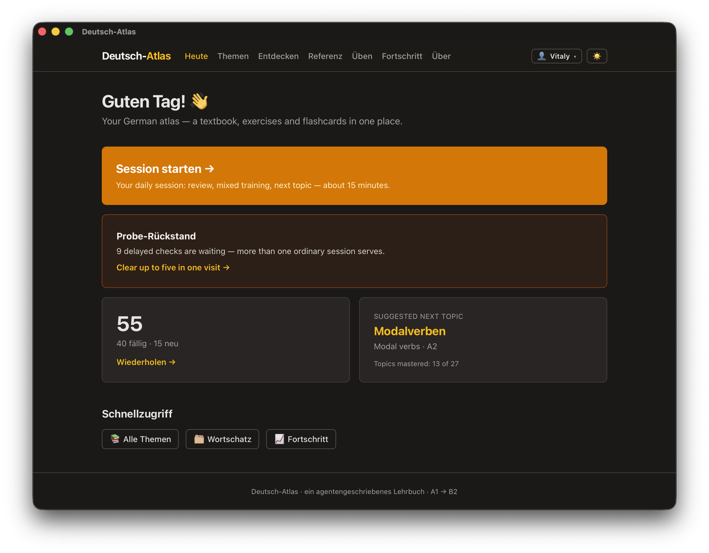

# Deutsch-Atlas

[](https://github.com/VitalyVorobyev/deutsch-textbook/actions/workflows/ci.yml)

A free, local-first app by **Vitaly Vorobyev** for learning German — a structured textbook, interactive
exercises, and spaced-repetition flashcards in one place. It runs in your browser
or as a desktop app and keeps everything on your device. Explanations are
bilingual: every topic is written twice, in English and in Russian (Ukrainian
too, and German itself from B1 on), and you switch between them at any time.
The German examples, tables and readings are always visible.



*The Heute (Today) screen is the front door: one button starts a ~15-minute
guided session, while the app keeps track of what's due for review, what you've
mastered, and the next topic to learn.*

> **Why it's different.** No ads, no accounts, no gamification. The design
> follows what learning research actually supports — active recall, typed
> answers, spaced review, interleaved practice, and an explanation the moment
> you get something wrong. And automatically scored answers are kept visibly
> apart from your own writing and speaking: the app never dresses up practice as
> a verified result.

## What's inside

- **A complete A1 and A2 course, and B1 in progress** — ten A1 and twenty-two A2
  units, each with a diagnostic pretest, a full article, a graded reading,
  exercises, and its own vocabulary; ten of the fourteen contracted B1 units
  are live. Every headword of the Goethe-Institut's A1 and A2 Wortlisten is
  covered, and the Über page reports how far each level goes with figures
  measured from the content itself, not hand-written.

<!-- The figures above are re-derived, never remembered. `bun test` fails if this
     bullet and the content disagree (tests/published-claims.test.ts).
       units per level:   bun -e 'const {getCurriculum}=await import("./src/lib/curriculum.ts");
                            const c={}; for (const u of getCurriculum().units) c[u.level]=(c[u.level]??0)+1;
                            console.log(c)'
       B1 contract total: docs/curriculum/a2-b1.md — frozen 2026-07-24 at fourteen units -->

- **Interactive exercises with instant feedback** — multiple choice, gap-fill,
  matching, word order, tables, translation, open writing, speaking, and
  listening or reading comprehension. Get one wrong and a short explanation of
  the rule appears at once, in English or Russian.
- **Flashcards with real recall** — vocabulary becomes flashcards both ways,
  scheduled by FSRS (modern spaced repetition). In the production direction you
  *type* the German — article included — instead of just flipping the card, and
  every word comes with pronunciation (IPA) and audio.
- **Reading you work through, and reading you just read** — every topic has a
  short glossed text with comprehension questions, and alongside them a longer,
  easier story to read straight through for meaning, the kind of reading that
  builds fluency rather than testing it.
- **A ~15-minute guided daily session** — any due retention checks first, then
  due flashcards, a short mixed-exercise workout, and a suggestion for what to
  read next.
- **Delayed checks that ask what actually stuck** — two, seven and twenty-one
  days after you learn something, the app asks again in a fresh variant, so the
  answer has to come from the rule rather than from remembering the question.
- **Weak-spot training and an honest progress dashboard** — exercises from
  different topics are interleaved, prioritizing what you recently got wrong and
  the specific confusions your history shows (dative pronouns, haben/sein, word
  order …). Fortschritt shows an activity heatmap, streak, per-topic completion,
  and trends for each of those confusions.

## Getting it

**Use it in the browser** — the site is deployed at
<https://deutsch.vitavision.dev/>. Nothing to install; progress stays in your
browser.

**Signing in is optional.** Without an account the app is complete and entirely
local — an account only adds a copy of your progress in the cloud so a second
device can pick it up. New accounts are approved by hand, so if you sign in and
are told your account is waiting, keep going: everything is saved on your device
and uploads once it is approved.

**Or install it on your phone** — it is a Progressive Web App, so the same URL
installs to the home screen on iOS (Safari → Share → *Zum Home-Bildschirm*) and
Android (Chrome → *App installieren*), with no app store involved. It then runs
in its own window and keeps working offline: visited pages, the recordings you
have played and all of your progress stay on the device.
[Installation instructions and a QR code](https://deutsch.vitavision.dev/install).
On iOS, installing also stops the system evicting your saved progress after a
week of not opening it.

**Or install the desktop app** (Windows, Linux, macOS) from
[GitHub Releases](https://github.com/VitalyVorobyev/deutsch-textbook/releases):

- **Windows**: `.exe` (NSIS) or `.msi`. SmartScreen may warn — choose
  *More info → Run anyway*.
- **Linux**: `.deb` (`sudo apt install ./deutsch-atlas_…_amd64.deb`) or
  `.AppImage` (`chmod +x`, then run). Text-to-speech needs `speech-dispatcher`
  with a German voice; without one, audio-comprehension tasks fall back visibly
  to reading comprehension.
- **macOS**: `.dmg`, unsigned — after moving the app to Applications run
  `xattr -cr /Applications/Deutsch-Atlas.app`, or right-click → Open
  (macOS 15+: System Settings → Privacy & Security → Open Anyway).

**Or run it locally** with [Bun](https://bun.sh):

```sh
bun install
bun run dev   # http://localhost:4321
```

## Your data

Everything stays with you. On first open the app asks for a name and creates a
local profile — no account, no server, no tracking. Several people can share
one device, each with fully separate progress. Exercise attempts and flashcard
scheduling are stored in your browser (or in the desktop app's own storage) and
recorded automatically as you practice.

The Fortschritt (progress) page can export your progress as a JSON snapshot and
import it elsewhere — for example to move from the website to the desktop app.
Import merges by default, so nothing is overwritten without asking.

## Development

Project documentation is indexed in [`docs/README.md`](docs/README.md); authoring agents start with
[`CLAUDE.md`](CLAUDE.md).

Deutsch-Atlas is a static [Astro](https://astro.build) site with React islands,
Tailwind CSS, and a thin [Tauri v2](https://tauri.app) shell for the desktop
build; all content lives in the repo as MDX and YAML, validated against Zod
schemas. Bun is the package manager and task runner.

| Command | What it does |
| --- | --- |
| `bun run dev` | dev server |
| `bun run validate` | validate all content against schemas and cross-references |
| `bun test` | domain regression tests |
| `bun run check` | type-check (`astro check`) |
| `bun run lint` | ESLint over `src/` and `scripts/` |
| `bun run build` | static production build |
| `bun run review:gate` | require green CI, resolved review threads and a current-HEAD Codex review |
| `bun run gen:ipa` | fill missing Lautschrift on vocabulary entries (needs `espeak-ng`) |
| `bun scripts/coverage.ts A1` | Goethe Wortliste coverage report (`A1`, `A2` or `B1`) |
| `bun scripts/grammar-coverage.ts A1` | structural coverage against the grammar inventory (`A1`, `A2` or `B1`) |
| `bun tauri dev` / `bun tauri build` | desktop app (needs a [Rust toolchain](https://rustup.rs)) |

Listening authors can launch the local Python studio documented in
[`tools/listening-studio/README.md`](tools/listening-studio/README.md). It publishes only reviewed
WAV, exercise and provenance artifacts and never handles learner data.

Before opening a pull request, run the complete gate — the same one CI runs:

```sh
bun run validate
bun test
bun run check
bun run lint
bun run build
```

Content authoring rules — bilingual voice, CEFR discipline, exercise and IPA
conventions — are in [CLAUDE.md](CLAUDE.md).

Deutsch-Atlas is AI-assisted, human-directed and edited. AI systems support drafting and asset
generation; they are not credited as authors. The project’s ownership, licence boundaries and
authorship-provenance process are summarized in [NOTICE.md](NOTICE.md) and
[docs/authoring/product-protection.md](docs/authoring/product-protection.md).

## Licence

The application code is MIT — see [LICENSE](LICENSE). The course-specific
`src/assets/illustrations/` and `src/components/visuals/` directories are explicitly excluded
from that grant; they are not dual-licensed. The course material in `content/` — articles,
exercises, readings and vocabulary — together with those illustrations and the instructional
documents listed in [content/LICENSE](content/LICENSE), is Creative Commons **BY-SA 4.0**:
use and adapt it freely, with credit, under the same licence.
